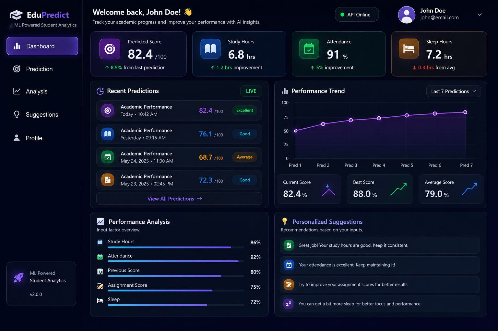
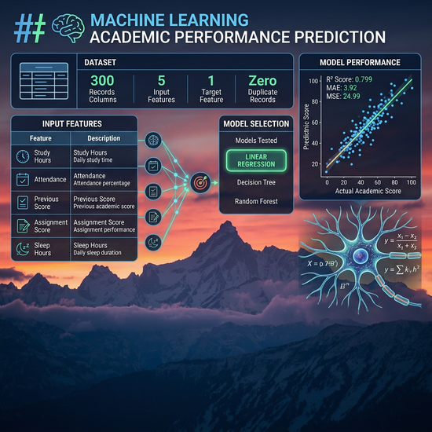
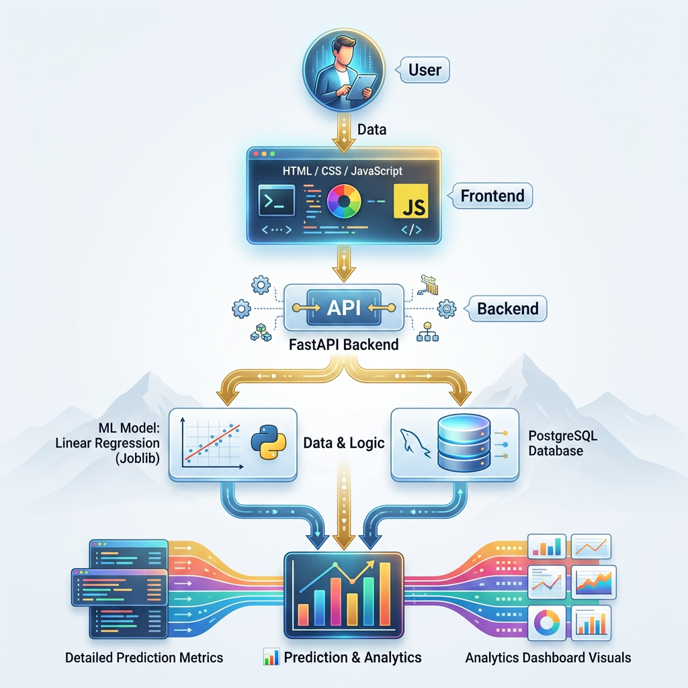

# 🎓 Student Performance Prediction

An end-to-end Machine Learning web application designed to predict a
student's final academic performance based on important academic and
lifestyle factors.

The application uses a trained **Linear Regression Machine Learning model**
to estimate a student's final score from five input features:

- 📚 Study Hours
- 📅 Attendance Percentage
- 📊 Previous Score
- 📝 Assignment Score
- 😴 Sleep Hours

The predicted result is presented through an interactive dashboard that
helps students understand their performance, analyze contributing factors,
and receive personalized suggestions for improvement.

---

## 🌟 About the Project

Student Performance Prediction is a full-stack Machine Learning project
that combines **Machine Learning, FastAPI, PostgreSQL, HTML, CSS, and
JavaScript** into a single web application.

The main goal of the project is to provide students with an easy-to-use
platform where they can enter their current academic information and
receive an estimated final performance score.

Instead of only displaying a prediction, the application provides
additional analytics such as performance levels, input-factor analysis,
prediction history, performance trends, and personalized recommendations.

---

## 🎯 Project Objective

The objective of this project is to:

- Predict a student's final academic score.
- Analyze the factors affecting academic performance.
- Provide useful recommendations based on student inputs.
- Store prediction history securely.
- Provide a personalized student dashboard.
- Demonstrate the complete Machine Learning deployment workflow.

---

## 🔄 How the Application Works

1. 👤 Student creates an account.
2. 🔐 Student logs into the application.
3. 📊 Student enters academic and lifestyle information.
4. 🤖 The FastAPI backend receives the input.
5. 🧠 The trained Machine Learning model processes the data.
6. 🎯 The model predicts the final score.
7. 📈 The dashboard displays the prediction and analysis.
8. 💡 Personalized suggestions are generated.
9. 🕘 The prediction is stored in PostgreSQL.
10. 📊 Previous predictions can be viewed through the dashboard.

---

## 📸 Project Preview



---

## 🚀 Live Demo

[🌐 Open Student Performance Prediction](https://student-performance-prediction-klam.onrender.com)

---

## 📊 Project Presentation

[📥 Download Project Presentation](./Student-Performance-Prediction.pdf)

---

## 🎯 Problem Statement

### 📌 Lack of Early Performance Prediction
Students often do not know their expected academic performance until
the final examination or result is available.

### 📊 Limited Data-Driven Insights
Traditional academic evaluation mainly focuses on previous marks and
does not provide a simple way to analyze multiple factors together.

### 📚 Multiple Factors Affect Performance
Academic performance can be influenced by factors such as:

- Study Hours
- Attendance
- Previous Score
- Assignment Score
- Sleep Hours

### ⚠️ Difficulty Identifying Weak Areas
Students may find it difficult to understand which areas require
improvement and what actions they should take.

### 💡 Lack of Personalized Recommendations
Existing basic prediction systems may provide only a score without
giving useful suggestions for improving student performance.

---

## 💡 Proposed Solution

### 🤖 Machine Learning-Based Prediction
A Machine Learning model is used to predict the student's final academic
score using five important input factors.

### 📊 Multi-Factor Analysis
The system analyzes:

- 📚 Study Hours
- 📅 Attendance
- 📊 Previous Score
- 📝 Assignment Score
- 😴 Sleep Hours

to generate a predicted final score.

### 📈 Performance Analysis
The application converts the input values into visual progress indicators
so students can easily understand their current performance factors.

### 💡 Personalized Suggestions
Based on the student's inputs, the system generates recommendations for
improving study habits, attendance, assignments, and sleep.

### 🕘 Prediction History
Predictions are stored in PostgreSQL so students can view their previous
prediction results.

### 📊 Performance Trend
The dashboard provides a performance trend graph to visualize recent
prediction activity.

### 👤 Personalized Student Dashboard
Each registered student gets a personalized dashboard and profile,
allowing them to manage their information and view their prediction data.

### 🌐 Complete Web Application
The Machine Learning model is integrated with a FastAPI backend and a
responsive HTML, CSS, and JavaScript frontend.

### ☁️ Cloud Deployment
The application is deployed online using Render, making the system
accessible through a web browser.

---

## ✨ Features


- 🔐 User Registration & Login
- 🔒 Secure Password Hashing
- 👤 User Profile
- 🎯 AI Performance Prediction
- 📈 Performance Analysis
- 💡 Personalized Suggestions
- 🕘 Prediction History
- 📊 Performance Trend Graph
- 🗑️ Selective History Deletion
- 📱 Responsive Design
- 🌌 Animated Earth/Space UI
- 🚀 Render Deployment

---

## 🛠️ Technology Stack


| Category | Technology |
|---|---|
| Frontend | HTML, CSS, JavaScript |
| Backend | FastAPI |
| Database | PostgreSQL |
| ORM | SQLAlchemy |
| Machine Learning | Scikit-learn |
| Data Processing | Pandas, NumPy |
| Model Storage | Joblib |
| Authentication | Password Hashing + Sessions |
| Deployment | Render |
| Version Control | Git & GitHub |

---

## 🧠 Machine Learning

### Dataset

 - 300 records
- 6 columns
- 5 input features
- 1 target feature
- Zero duplicate records

### Input Features

| Feature | Description |
|---|---|
| Study Hours | Daily study time |
| Attendance | Attendance percentage |
| Previous Score | Previous academic score |
| Assignment Score | Assignment performance |
| Sleep Hours | Daily sleep duration |

### Models Tested

1) Linear Regression
2) Decision Tree
3) Random Forest

### Selected Model

**Linear Regression**

### Model Performance

| Metric | Result |
|---|---:|
| R² Score | 0.799 |
| MAE | 3.92 |
| MSE | 24.99 |

---

## 📊 Feature Influence


| Feature | Coefficient |
|---|---:|
| Study Hours | 10.04 |
| Previous Score | 3.87 |
| Attendance | 3.83 |
| Assignment Score | 2.95 |
| Sleep Hours | 0.75 |

---

## 🏗️ System Architecture



```text
👤 User
   │
   ▼
┌──────────────────────┐
│ HTML / CSS / JavaScript │
│      Frontend        │
└──────────┬───────────┘
           │
           ▼
┌──────────────────────┐
│       FastAPI        │
│       Backend        │
└──────────┬───────────┘
           │
     ┌─────┴──────┐
     ▼            ▼
┌──────────┐  ┌────────────┐
│ ML Model │  │ PostgreSQL │
│ Joblib   │  │  Database  │
│ Linear   │  │            │
│Regression│ │            │
└─────┬────┘  └─────┬──────┘
      │              │
      └──────┬───────┘
             ▼
    📊 Prediction & Analytics          
          ▼                ▼
       


